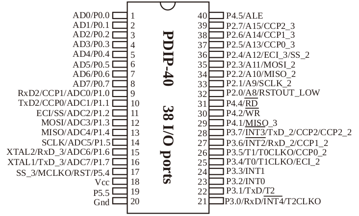

# 8x16 snake

## Compiling the code

1. Install VSCode
1. Install the PlatformIO extension
1. Navigate to the PlatformIO > Quick Access > PIO Home > Devices
1. In the Platforms > Embedded search for "Intel". 
1. Find the "Intel MCS-51 (8051)" entry and click on it.
1. In the "Intel MCS-51 (8051) page click Install, this project used version 2.1.0

## Uploading the code

1. Connect to the MCU serial port (verified CP2102 and CH341A)
2. MCU Gnd pin 20 - Serial Gnd
3. MCU RX pin 21 - Serial Tx
4. MCU Tx pin 22 - Serial RX
5. Open platformio.ini, find the "upload_port" line and change it to match the serial device that is connected to the microcontroller.
6. PlatformIO > STC15F2K60S2 > General > Build or Upload

## Description

8x16 game based on `STC15F2K60S2` - an Intel 8051 clone by STC.

The purpose of this project is to:
1. Rewrite the stock firmware with some alternative games.
1. Teach microcontroller programming on a cheap and starightforward platform

Microcontroller details:
`STC15F2K60S2`
`28I-PDIP40 `
`1845HVV065.XD`

Microcontroller decoding:
| Field   | Details |
| ------- | ------  |
| STC     | The program Flash in user program area can not be used as EEPROM, but there are special EEPROM    |
| 15      | 15 STC 1T 8051 MCU, Speed is 8~12 times faster than the traditional 8051 in the same working frequency. STC15 series MCU with super high-speed CPU core of STC-Y5 works 20% faster than STC early 1T series such as STC12/STC11/STC10 series at same clock frequency. |
| F       | Operating Voltage 5.5V~4.2V |
| 2K      | Large capacity of on-chip 2048 bytes SRAM: 256 byte scratch-pad RAM and 1792 bytes of auxiliary RAM |
| 60      | Program space, e.g. 60:60KB |
| S2      | 2 UARTs (can be used simultaneously)' SPI' Internal EEPROM'  A/D Converter(PWM also can be used as DAC)'  CCP/PWM/PCA |
| 28      | Up to 28MHz |
| I       | Industrial, -40c-85c |
| PDIP 40 | Package |

The MCU, according to "Chapter 3 Memory Organization and SFRs" has a total of 2048 bytes SRAM of RAM
* 256 byte scratch-pad RAM (idata)
* 1792 bytes of auxiliary RAM (XRAM, xdata)

Storage
IAP can be used to store program data.
Program memory: 0000H~0EFFFH (60K)

## Hardware required

* 8x16 game

USB Serial converters tested:
* Silicon Labs CP2102 
* CH341A based programmer that is switched to USB to Serial converter mode (Jumper between pins 2 and 3)

## Alternative environment setup 

The recommended compiler for this project is sdcc, alternatively Keil uVision can be used to compile code for Intel 8051. Keil was originally used for this project, but the project has not switched to sdcc.

Official STC documentation recommends Keil uVision. The development environment will have to be 

* Install Keil uVision C51, the version for 8051 microcontrollers. The version used in this project is V5.27.1.0. It will include the C compiler - C51 and the Intel 8051 assembly compiler A51.
* Download "STC ISP programming software (v6.86)" from http://www.stcmicro.com/rjxz.html
* Open "Keil ICE Settings" tab, Add MCU type to Keil

## Hardware tweaks

1. Capacitors at the MCU power ports. 
   The spec asks for a 47uF electrolytic and a 0.1uF ceramic capacitor at the power input of the MCU, need to add those.
1. Reroute OK and Reset buttons to empty pins to free up UART0 for programming and debug output.

### Uart
Two high-speed asynchronous serial ports UARTs (UART1/UART2 can be used simultaneously and regarded as 5 serial ports by shifting among 5 groups of pins):
* UART1(RxD/P3.0, TxD/P3.1) can be switched to (RxD_2/P3.6, TxD_2/P3.7), also can be switched to (RxD_3/P1.6, TxD_3/P1.7);
* UART2(RxD2/P1.0, TxD2/P1.1) can be switched to (RxD2_2/P4.6, TxD2_2/P4.7).

STC15F2K60S2 pinout



MCU Board logical layout

| Connection | GPIO Pin | GPIO Pin | Connection |
| ---------- | -------- | -------- | ---------- |
| R4+        | P00      | P45      | R1+  |
| R6+        | P01      | P27      | R3+  |
| R7+        | P02      | P26      | C1- |
| R5+        | P03      | P25      | D1- |
| R2+        | P04      | P24      | C0- |
| R8+        | P05      | P23      | D0- |
| R11+       | P06      | P22      | C5- |
| R9+        | P07      | P21      | C3- |
|            | P10      | P20      | R0+ |
| R14+       | P11      | P44      | C2- |
| R13+       | P12      | P42      | C4- |
| R10+       | P13      | P41      | D2- |
| R12+       | P14      | P37      | BtnLeft |
|            | P15      | P36      | BtnDown |
|            | P16      | P35      | C6- |
| C7-        | P17      | P34      | |
| R15+       | P54      | P33      | BtnRight |
| 5v         | VCC      | P32      | BtnUp |
| Spkr       | P55      | P31      | BtnRst / U0 TX |
| 0v         | GND      | P30      | BtnOK / U0 RX |

```

 Rx - Row number x in the dot matrix display, X in [0, 15]. Rows are positive
 Cy - Column number y in the dot matrix display, Y in [0, 7]. Clumns are negative
 Dz - Digit number z, z in [0, 2]. Digit "rows" are negative, thank you.

Each digit has the following layout corresponding to the dot matrix columns:
              Col 6+
     Col 5+              Col 0+
              Col 4+
     Col 2+              Col 3+
              Col 1+

```

Board Physical layout MCU
| Connection | MCU Pin | MCU Pin | Connection |
| ---------- | ------- | ------- | ---------- |
| A16+       | 1       | 40      | A3+  |
| A15+       | 2       | 39      | A5+  |
| A12+       | 3       | 38      | A14- / B14- / C8+ |
| A10+       | 4       | 37      | C3- |
| A9+        | 5       | 36      | A4- / B4- / C2+ |
| B8+        | 6       | 35      | C1- |
| B5+        | 7       | 34      | A6- / B6- / C10+ |
| B3+        | 8       | 33      | A7- / B7- / C9+ |
|            | 9       | 32      | A8+ |
| B15+       | 10      | 31      | A13- / B13- / C7+ |
| B10+       | 11      | 30      | A11- / B11- / C6+ |
| B9+        | 12      | 29      | C5- |
| B16+       | 13      | 28      | BtlLeft |
|            | 14      | 27      | BtnDown |
|            | 15      | 26      | A2- / B2- / C4+ |
| A1/B1-     | 16      | 25      |  |
| B12+       | 17      | 24      | BtnRight |
| 5V         | 18      | 23      | BtnUp |
| SPKR       | 19      | 22      | BtnReset |
| Gnd        | 20      | 21      | BtnOk |

8x8 grid A - top
| Connection | Pin | Pin | Connection |
| ---------- | --- | --- | ---------- |
| MCU16-     | 1   | 16  | MCU1+      |
| MCU26-     | 2   | 15  | MCU2+      |
| MCU40+     | 3   | 14  | MCU38-     |
| MCU36-     | 4   | 13  | MCU31-     |
| MCU39+     | 5   | 12  | MCU3+      |
| MCU34-     | 6   | 11  | MCU30-     |
| MCU33-     | 7   | 10  | MCU4+      |
| MCU32+     | 8   | 9   | MCU5+      |

8x8 grid B - bottom
| Connection | Pin | Pin | Connection |
| ---------- | --- | --- | ---------- |
| MCU16-     | 1   | 16  | MCU13+     |
| MCU26-     | 2   | 15  | MCU10+     |
| MCU8+      | 3   | 14  | MCU38-     |
| MCU36-     | 4   | 13  | MCU31-     |
| MCU7+      | 5   | 12  | MCU17+     |
| MCU34-     | 6   | 11  | MCU30-     |
| MCU33-     | 7   | 10  | MCU11+     |
| MCU6+      | 8   | 9   | MCU12+     |

Digital display C
| Segment   | Connection | Pin | Pin | Connection | Segment     |
| -------   | ---------- | --- | --- | ---------- | ---------   |
| Digit1-   | MCU35-     | 1   | 10  | MCU34+     | Up Left+    |
| Up Right+ | MCU36+     | 2   | 9   | MCU33+     | Down Right+ |
| Digit2-   | MCU37-     | 3   | 8   | MCU38+     | Down+       |
| Up+       | MCU26+     | 4   | 7   | MCU31+     | Down Left+  |
| Digit3-   | MCU39-     | 5   | 6   | MCU30+     | Mid+        |

## Case

TODO(mogo): Put a link to the 3d print model for the case.

## Links

Stripped-down datasheet
http://www.stcmicro.com/datasheet/STC15F2K32S2_Features.pdf

Full datasheet
http://www.stcmicro.com/datasheet/STC15F2K60S2-en.pdf
https://datasheetspdf.com/pdf-file/1316710/STC/STC15F2K60S2/1

Software downloads
http://www.stcmicro.com/rjxz.html

Keil
https://www.keil.com/demo/eval/c51.htm
